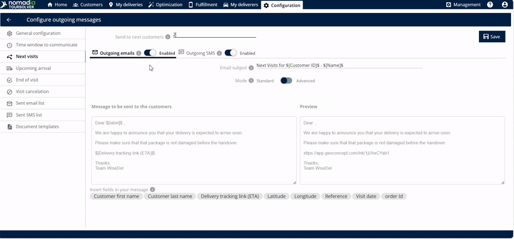
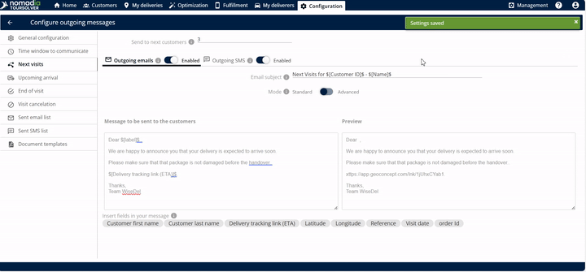
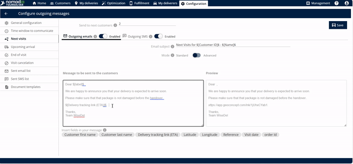

# CustomerCommunication-NextVisits

This guide will help you confidently set up automated notifications using the **CustomerCommunication-NextVisits** feature, ensuring your customers are informed when you are arriving soon.

***

## 1. Introduction

The **CustomerCommunication-NextVisits** feature is designed to automate notifications, letting your upcoming customers know that you are on your way. This ensures smooth communication and better preparation for your arrival.

You can choose exactly how many future customers receive this message, customize the content, and decide whether to send it via email or SMS.

***

## 2. Getting Started

To begin using this powerful communication tool, follow these initial steps to access the feature and define your communication preferences.

### System Requirements and Installation

⚠️ **Warning:** The provided sources do not contain information regarding **System Requirements** or **Installation/Setup Steps**. We assume the feature is already installed and accessible within your main application interface.

### Initial Configuration

Your first step is to define how you will notify your upcoming customers.

**Step 1: Access the Next Visits Feature**
Click on **next visits**.

**Step 2: Define the Target Customer Count**
Specify the number of upcoming customers you want to notify. You can choose to send a notification to the next one, two, or three customers.

*   If you enter **one**, the email is sent to the next customer.
*   If you enter **two**, the email is sent to the next two customers.
*   If you enter **three** (or any number you wish), the email is sent to that number of customers.

**Step 3: Enable Communication Channels**
You must enable the methods you wish to use for sending notifications. You have options for both email and SMS.
*   Enable the **outgoing emails** setting.
*   Enable the **outgoing SMS** setting.

***

## 3. Feature Explanations with Benefits

The strength of this tool lies in its customization and trigger mechanism.

| Feature | Usefulness/Benefit | Source |
| :--- | :--- | :--- |
| **Send to Next Customers Setting** | Allows you to precisely control how many upcoming customers receive the "arriving soon" message (e.g., 1, 2, or 3). | |
| **Email Subject Editing** | You can enter and customize the **email subject** so customers immediately know the purpose of the message. | |
| **Message Body Editing** | You can freely **edit the message** that will be sent to your customers, allowing for personalized language and important details. | |
| **Personalization Tags ($)** | Entering the **dollar symbol** ($) reveals options that you can insert and edit directly into the body of the email, saving you time. | |
| **Preview Window** | Before saving, you can see the **preview** of the exact message that will be sent, ensuring it looks professional and accurate. | |
| **"Delivered" Trigger** | The system only sends the notification once you enter the option **delivered** for the *current* customer, automatically triggering the message to the next set of customers. | |

***

## 4. Common Tasks with Detailed Steps

The most common task is setting up and saving the personalized message content and defining the number of recipients.

### Task: Customize and Save the Customer Communication Settings

This task ensures your upcoming customers receive a tailored message notifying them of your imminent arrival.

1.  **Enter the Email Subject**
    Find the field for the email subject and type in a clear, concise title.

2.  **Edit the Message Content**
    Customize the message body that will be sent to your customers.

3.  **Insert Personalized Information (Optional)**
    To include dynamic information (like a customer's name or specific appointment details), enter the **dollar symbol** ($). This will show options you can use to edit the body of the email.
    > 💡 **Tip:** Using personalization tags makes the message feel more direct and professional.

4.  **Review the Preview**
    Check the **preview** area to see exactly how the final email will look to the customer. This is your chance to review the message before saving.

5.  **Save Your Settings**
    Once you have entered and modified all the necessary information, click on **save**.

### Real-World Example: Notifying Two Upcoming Customers

Imagine you are completing a visit now. You want the next two customers on your schedule to know you are on your way immediately.

1.  In the "send to next customers" field, you enter **2**.
2.  You enable **outgoing emails**.
3.  You set the Subject: "We are arriving soon for your visit!".
4.  You save these settings.
5.  When you mark the *current* customer's status as **delivered**, the email is instantly sent to the next two customers in your queue.

***

## 5. Productivity Tips

Here are a few tips to maximize the efficiency of the Next Visits communication feature:

1.  **Leverage the Trigger Action:** Remember that the message is **only sent** once you successfully enter the option **delivered** for the customer you are currently serving. This delivery status acts as the trigger for the system to notify the upcoming customers.

2.  **Maximize Customization:** Always use the dollar symbol ($) when editing the message body. This ensures you utilize available fields for dynamic content, creating professional and detailed communication without manual entry every time.

3.  **Keep Message Count Low:** While you can notify two or three customers at once, consider the length of time between visits. Notifying only the **next customer** (by entering **1**) ensures the arrival estimate is as accurate as possible.

