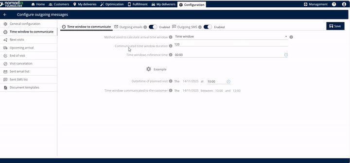
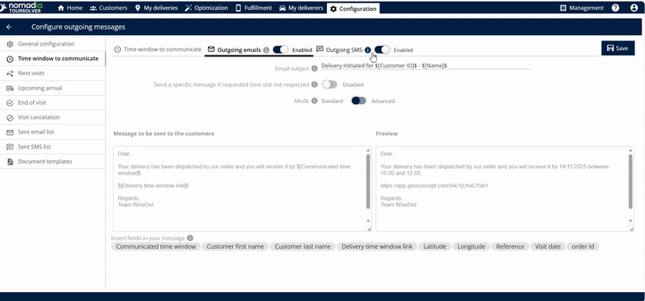
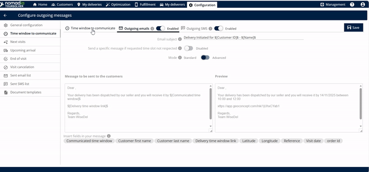

# CustomerCommunication-TimeWindowtoCommunicate

## Comprehensive User Guide: Time Window to Communicate

Welcome! This guide is designed to help you confidently use the **Time Window to Communicate** feature, ensuring your customers receive timely and clear information about upcoming visits. By setting clear communication windows, you improve customer satisfaction and efficiency.

---

### 1. Introduction

The **Time Window to Communicate** feature allows you to define the exact timeframe communicated to your customer regarding an upcoming visit. This tool calculates the arrival window and manages outgoing communication via email and SMS.

This guide uses a positive and encouraging tone to break down complex tasks into simple, clear steps, helping you succeed even if you are not technically inclined.

---

### 2. Getting Started

To begin managing customer communications, you first need to access the feature.

#### System Requirements and Setup ⚠️

The provided sources **do not contain information** regarding specific system requirements or detailed installation/setup steps for this feature. We will assume you already have access to the platform where this functionality resides.

#### Initial Access

To start, navigate directly to the feature interface:

1.  Click on **Time Window to communicate**.

**(Visual Placeholder: Screenshot 1 - Location of the "Time Window to communicate" button.)**

---

### 3. Feature Explanations and Benefits

This feature is powerful because it allows you to control exactly how the arrival information is calculated and delivered.

| Feature Component | Context and Usefulness | Source |
| :--- | :--- | :--- |
| **Time Window Selection** | You must select the method used to calculate the arrival time window. Use the drop-down menu to select **Time Window**. |, |
| **Communicated Time Window Duration** | This sets the length of the window communicated to the customer (e.g., if you enter 120 minutes, the customer sees a 2-hour arrival window). |, |
| **Time Window Reference Time** | This is the specific time used as the starting point for calculating the communicated time window. Click the clock icon to select this time. |, |
| **Date and Time of Planned Visit** | This crucial input ensures the arrival window is tied to the actual service schedule. Select the date and time using the clock icon. |, |

**Communication Capabilities:**

*   **Outgoing Emails:** You have the ability to enable outgoing emails. You can view a preview of the message that will be sent to the customer.
*   **Outgoing SMS:** You can also enable outgoing SMS communication. Here, you can see the message that will be sent to the customer and view its preview.

---

### 4. Common Tasks with Detailed Steps

The most common task is defining the arrival window and setting up customer notifications.

#### Task: Setting Up the Customer Communication Time Window and Notifications

Follow these steps to define the precise time window and enable communication for your customer visit.

1.  **Access the Feature:**
    Click on **Time Window to communicate**.

2.  **Define the Calculation Method:**
    *   Select the time window method which is used to calculate the arrival time window.

3.  **Set the Duration:**
    *   Enter the duration for the communicated time window.

    *   💡 **Tip:** Entering **120 minutes** will result in a 2-hour window communicated to the customer (e.g., 10 a.m. to 12 p.m.).

4.  **Select Reference Time:**

5.  **Input Planned Visit Details:**
    *   Locate the **Date and time of planned visit** field.

6.  **Review Calculated Time Window:**
    *   The system will display the **time window communicated to the customer**.
    *   For example, if you set the duration to 2 hours, the system might calculate the window as 10 a.m. to 12 p.m..

**(Visual Placeholder: Screenshot 2 - Interface showing Duration, Reference Time, and Calculated Time Window.)**

7.  **Enable Email Communication:**
    *   You can enable the **outgoing emails** option.
    *   Review the message that must be sent to the customer below this section.

8.  **Enable SMS Communication (Optional):**
    *   You can also enable the **outgoing SMS** option.

9.  **Save Your Settings:**

**(Visual Placeholder: Screenshot 3 - View of the Email and SMS enabling options, showing the "Preview" sections.)**

---

### 5. Productivity Tips

These tips will help you work more efficiently and ensure smooth communication with your customers:

*   **Use the Preview Feature:** Always use the message **preview** option available for both outgoing emails and outgoing SMS. This helps you confirm exactly what the customer will see before you save your settings, ensuring accuracy and clarity.
*   **Keep Durations Clear:** When setting the **Communicated Time Window Duration**, choose common increments (like 60 minutes or 120 minutes) that are easy for customers to understand. A clear, defined window prevents confusion.
*   **Saving is Key:** Remember that none of your settings will take effect until you click the **Save** button after entering all the details. Make saving the final mandatory step in your process.

**(Visual Placeholder: Screenshot 4 - Final screen showing the Save button highlighted.)**

Setting the Time Window to Communicate is like building a simple clock tower for your customers: you define the necessary inputs (the gears and springs) so that the calculated outcome (the hands showing the time) is clear, predictable, and immediately understandable to everyone viewing it.

