# Creating an account
# TourSolver User Guide: Creating Your Trial Account

Welcome to the TourSolver platform! We are excited to help you get started. This guide walks you through creating your account in the **TourSolver Test Environment** using simple, clear steps. Creating your account is quick and easy, building the foundation you need to start optimizing your routes.

***

## 1. Getting Started

### System Requirements & Limitations

Since you are setting up a trial account, there are a few things to note before you begin:

*   **Email Address:** You must have access to a valid email address to complete the verification process.
*   **Trial Account Limitations (⚠️ Warning):** Please note that the trial account comes with limitations. For example, you may be limited to **up to 250 visits per optimization**. If you need full access, you will need to switch to the production version later.
*   **Password Complexity:** Your chosen password must include:
    *   At least one uppercase letter.
    *   At least one lowercase letter.
    *   A number.
    *   A special character.

### The TourSolver Setup Flow

The account creation process involves three main stages:

1.  **Email Verification:** Confirming your email address using a one-time password (OTP).
2.  **Profile Creation:** Setting your name, country, and secure password.
3.  **Onboarding:** Providing essential company details (e.g., activity, number of vehicles).

***

## 2. Common Task: Creating and Configuring Your Account

### Task 1: Signing Up and Verifying Your Email

This step registers your email address and confirms you are a real user.

1.  **Start the Sign-Up Process:** Click on **sign up now** to begin creating your account.

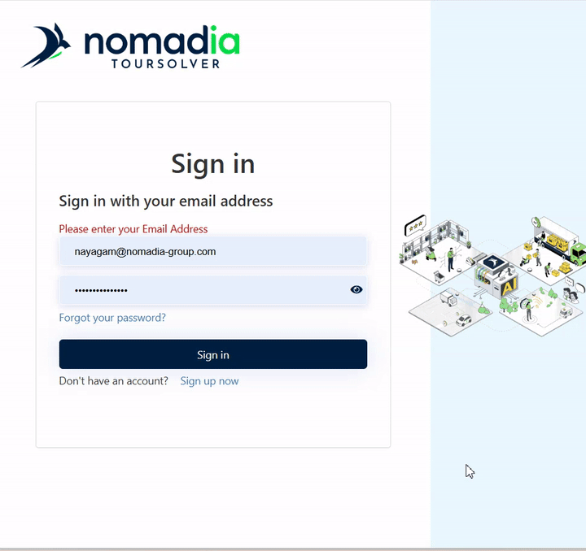

2.  **Enter Your Email:** Enter your email address into the required field and click **send verification code**.

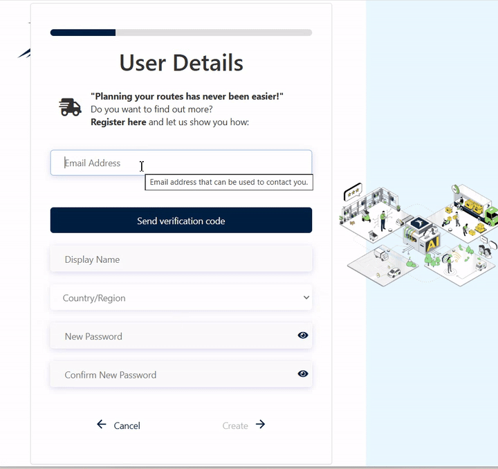

3.  **Retrieve the OTP:** You will receive a One-Time Password (OTP) via email. Copy this OTP.

4.  **Paste and Verify:** Paste the copied OTP into the **OTP verification field**.

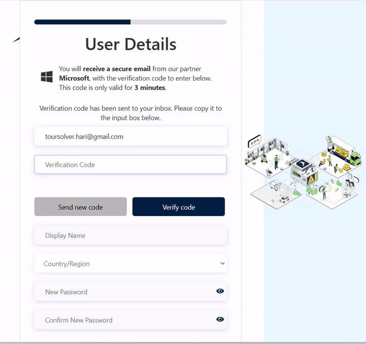

5.  **Confirm the Code:** Click **verify code**.
    *   **Expected Result:** Once verified, you will receive a confirmation message saying your email has been verified.

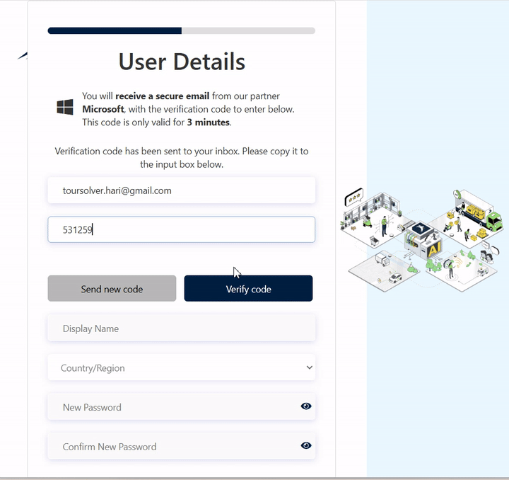

> **Visual Guidance (Screenshot 1: Email Verification)**
> This screenshot should capture the interface showing the email input field, the "Send Verification Code" button, the OTP verification field, and the final "Verify Code" button, indicating the flow of the security measure.

### Task 2: Setting Your Profile Details

Once your email is confirmed, you will set up your personal login credentials.

1.  **Fill in Your Details:** Fill in your **Name** and select your **Country**.

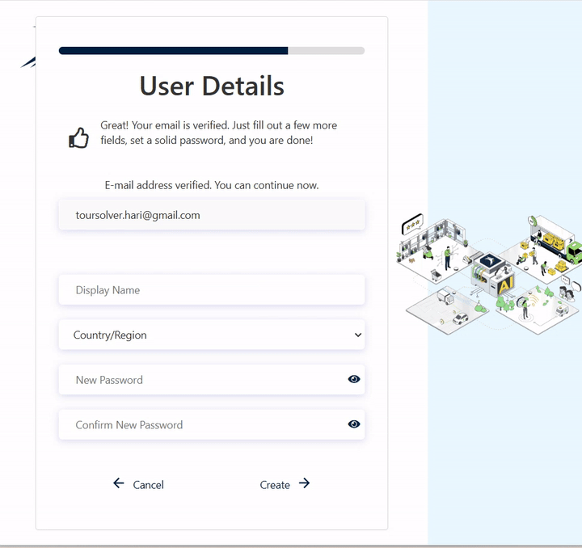

2.  **Enter Your Password:** Enter your desired password. Remember the strict requirements: it must include at least one uppercase letter, one lowercase letter, a number, and a special character.

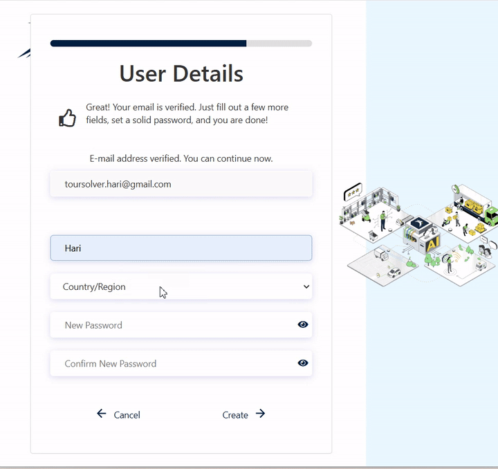

    *   ⚠️ **Warning:** If you type the passwords incorrectly or they do not match, you will get a message stating, "the password do not match. Please enter the correct password".

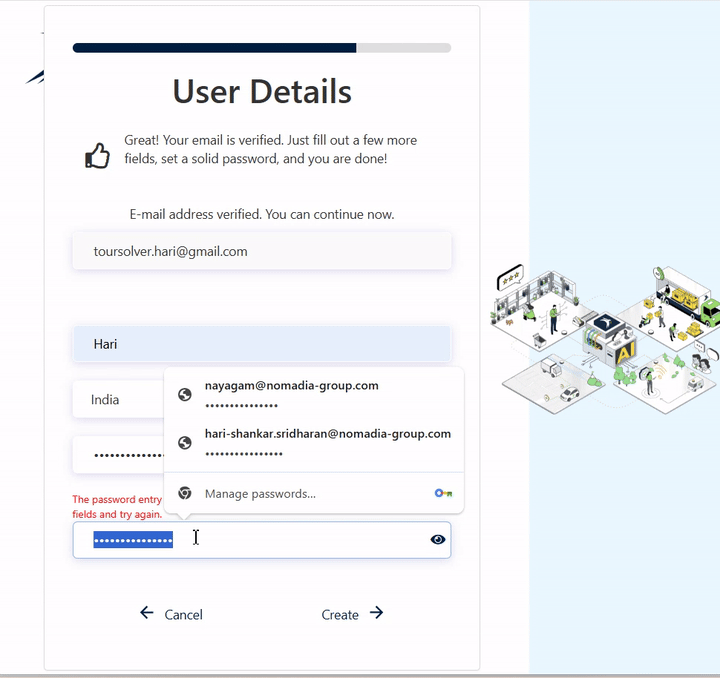

3.  **Complete Profile Setup:** Click **create** (or **create to continue**) to finalize your profile.

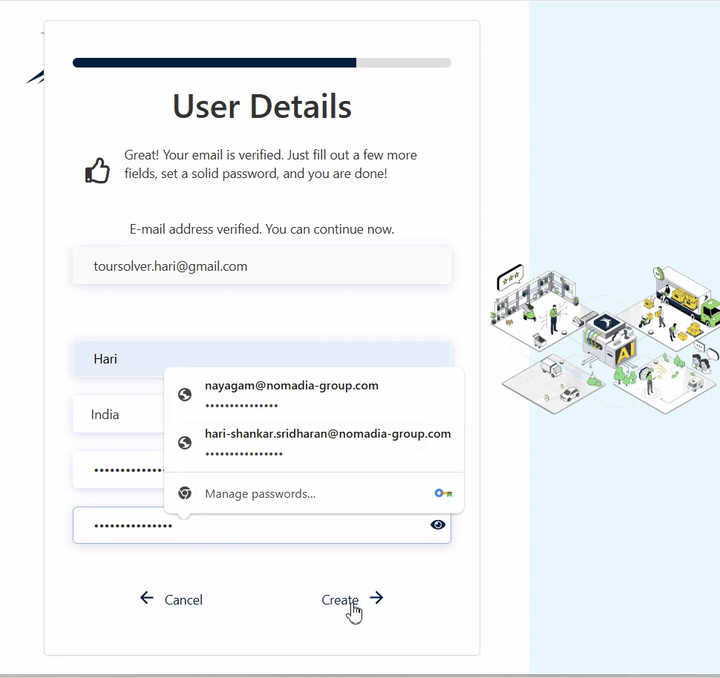

> **Visual Guidance (Screenshot 2: Profile Details & Password Creation)**
> This screenshot should focus on the section where Name, Country, and Password (entered twice for confirmation) fields are visible, possibly highlighting the text explaining the password complexity requirements.

### Task 3: Initial Configuration (Onboarding)

The Onboarding page asks for information about your company and operations.

1.  **Enter Company Information:** Enter your company details, such as the company **name** and **address**.

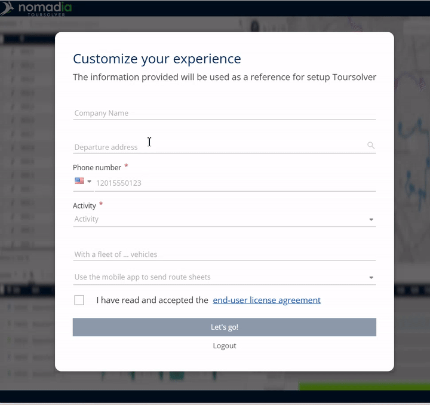

2.  **Specify Contact and Activity:** Next, specify your **phone number** and then mention the **activity** of your company (what services you provide).

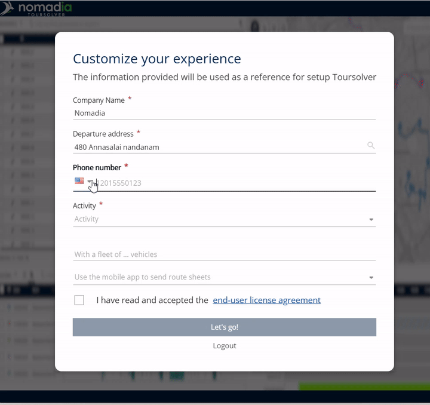

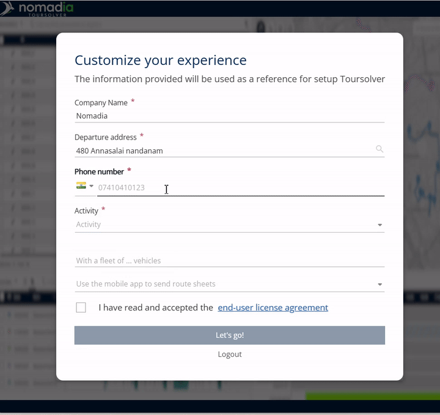

3.  **Define Vehicle Needs:** Specify the **number of vehicles** you want to manage within the platform.

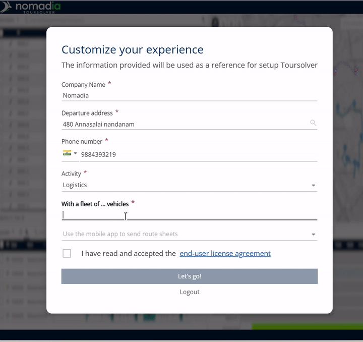

4.  **Accept the Agreement:** Before proceeding, you must check the **end user license agreement** (EULA). Tick the box to accept it and continue.

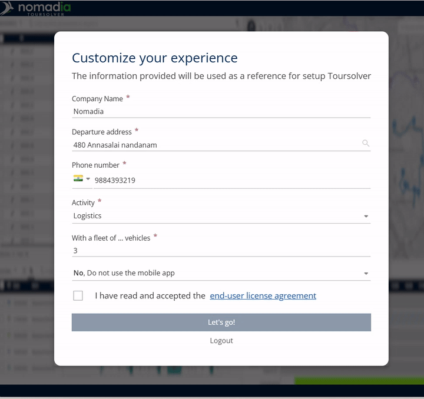

5.  **Finish Onboarding:** Click **let's go** to continue.

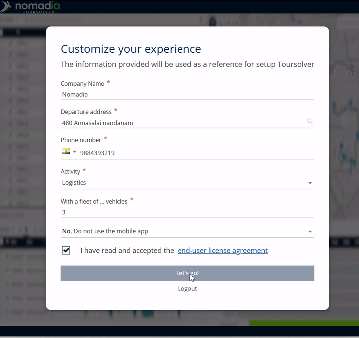

> **Visual Guidance (Screenshot 3: Onboarding Page)**
> This screenshot should clearly show the fields for Company Name, Address, Phone Number, Activity, and Number of Vehicles, along with the checkbox required for accepting the End User License Agreement (EULA).

### Task 4: Confirming Setup

1.  **Account Creation:** Your TourSolver trial account will be automatically created after completing the onboarding steps.

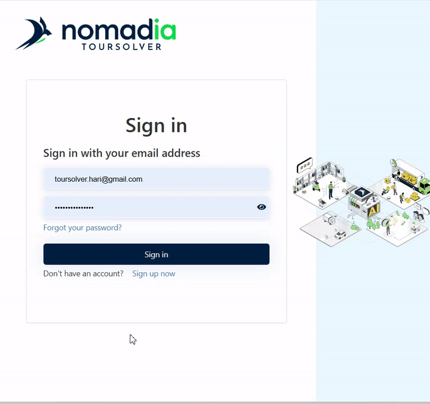

2.  **Final Login:** Finally, **login again with your credentials** (the email and password you just created) to confirm the setup is complete.

***

## 3. Feature Explanation & Benefits

Your **TourSolver Trial Account** is now ready!

The primary benefit of the trial account is immediate access to the routing platform. You can immediately begin testing the optimization features, although you should be aware of the specific limitations, such as handling **up to 250 visits per optimization**. This allows you to explore the platform's capabilities before committing to the full production version.

***

## 4. Productivity Tips

Here are a few tips to ensure a smooth start and secure access:

*   💡 **Keep Your Password Secure:** Since your password must meet rigorous security standards (uppercase, lowercase, number, special character), consider using a password manager or writing it down safely until you are familiar with it.
*   💡 **Remember Trial Limitations:** If your testing requires complex routes with more than 250 stops, remember that you will need to switch to the **production version** to unlock full access and remove that limitation.
*   💡 **Use Company Activity Context:** When specifying your *Activity* during onboarding, be specific. This context helps the platform understand the nature of the routes you will be solving.

