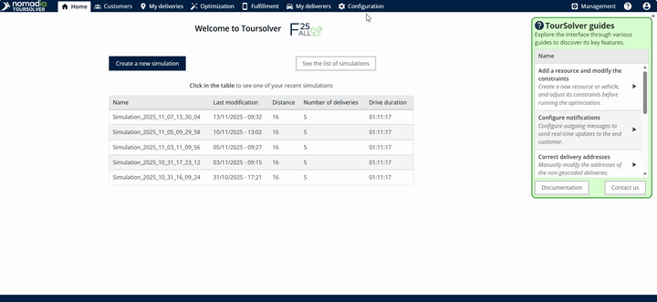
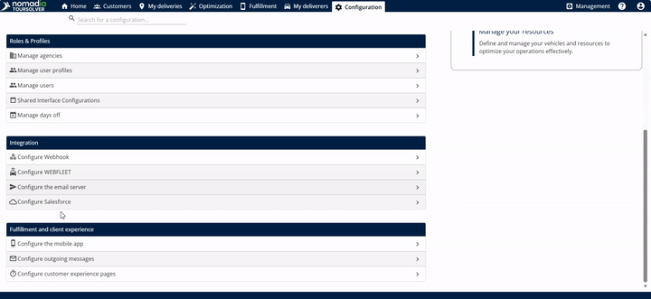
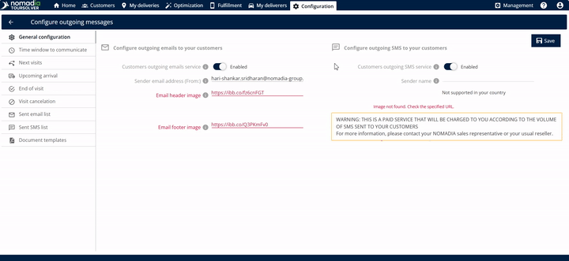
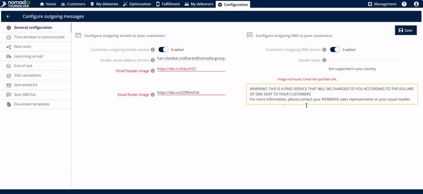

# General Configuration

## **Comprehensive User Guide: Customer Communication General Configuration**

Welcome! This guide is designed to help you quickly set up and manage how your business communicates with customers through email and SMS. By following these simple steps, you will build customer confidence and ensure your messages are delivered clearly and professionally.

***

### 1. Introduction

The **Customer Communication General Configuration** screen allows you to enable, disable, and customize the foundational settings for sending outgoing messages to your customers. You have the power to control both the **customer outgoing email service** and the **customer outgoing SMS service**.

***

### 2. Getting Started

#### System Requirements and Setup

The sources provided focus exclusively on configuring the outgoing communication settings. Information regarding specific operating system requirements or the initial installation steps for the software platform itself are not detailed in this material.

#### Initial Configuration: Accessing the Settings

To begin configuring your customer communication preferences, you need to navigate to the General Configuration screen:

1. **Start from the Homepage:** Go from the **home page**.

4. **Open General Configuration:** You will arrive at the **General configuration** screen.

***

### 3. Feature Explanations and Benefits

This configuration area manages two powerful ways you can reach your customers:

| Feature                             | Description & Usefulness                                                                                                                                                          |
| ----------------------------------- | --------------------------------------------------------------------------------------------------------------------------------------------------------------------------------- |
| **Customer Outgoing Email Service** | Enables the system to send emails to customers on your behalf. **Benefit:** You can customize the look of your emails using branding elements like your header and footer images. |
| **Customer Outgoing SMS Service**   | Enables the system to send text messages (SMS) directly to customers. **Benefit:** Provides fast, direct communication for urgent or important updates.                           |

**Key Considerations for SMS:**

* ⚠️ **Warning: Paid Service** – Enabling the outgoing SMS service is a **paid service**. You will be charged based on the volume of SMS messages sent to your customers.
* **Character Limit** – Each standard SMS message must be **160 characters**. If your message exceeds 160 characters, the system will automatically **split the SMS into two SMS messages**.

***

### 4. Common Tasks: Setting Up Customer Communication

This section guides you through the process of setting up and activating both your email and SMS communication channels.

#### Task 1: Enabling and Customizing Outgoing Email

Use these steps to turn on email communication and ensure your emails look professional with your brand images.

1. **Enable Email Service:** Once you are on the General Configuration screen, enable the **customer outgoing email service**.
2. **Enter Sender Email:** Enter the required **sender email address**.
   * _Visual Guidance 1: Configuration Screen_ (Show the configuration screen with the "customer outgoing email service" enabled and the "sender email address" field filled.)

4. **Add Footer Image Link (Optional):** Enter the **footer image link**. This often contains legal information or contact details. 💡 **Tip:** If you do not enter a header image link and a footer image link, the resulting email will be sent without these visual elements.

#### Task 2: Enabling Outgoing SMS

1. **Enable SMS Service:** Locate and enable the **customer outgoing SMS service**.
   * **Context:** If you enable this service, your customers will begin receiving SMS messages from the system.

#### Task 3: Saving Changes and Validating Your Email

To activate your communication setup, you must save your modifications and complete an important validation step.

2. **Receive Validation Email:** After clicking **save**, the system will automatically send an email to the sender address you provided. This email includes a **link to validate the email**.
   * _Visual Guidance 2: Validation Step_ (Show a diagram illustrating the flow: Click Save → System sends Validation Email to Sender Address.)
3. **Click Validation Link:** Go to your inbox, open the validation email, and click on the link provided.
4. **Activation Confirmed:** Once you click the link, the system will be authorized to send emails to customers **on your behalf**.

***

### 5. Productivity Tips

Here are a few tips to maximize your effectiveness when using the General Configuration settings:

* 💡 **Consistent Branding:** Always try to enter both the **header image link** and the **footer image link**. Using these links helps maintain professional branding for all emails sent to your customers.
* ⚠️ **Watch Your Character Count:** When sending SMS messages, remember the **160 character limit**. Keep your messages concise to avoid having them split into two separate, chargeable messages.
* 💡 **Immediate Validation:** To ensure seamless email delivery, complete the validation step immediately after clicking **save**. The validation link confirms that the system (referred to as Cruisers/Crew Solver) has permission to send messages using your chosen sender address.
