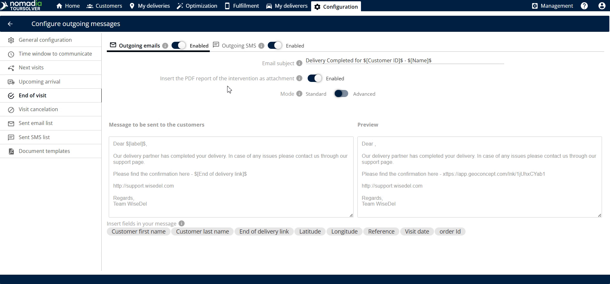
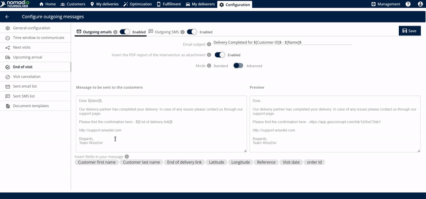
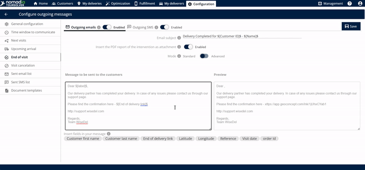

# CustomerCommunication-EndofVisit

# Comprehensive User Guide: End of Visit Customer Communication

This guide will show you how to automatically send delivery confirmations and proof-of-delivery documents to your customers immediately after a service visit or delivery is complete. By setting up this feature, you build confidence and ensure clear documentation for every successful delivery.

***

## 1. Introduction

The **End of Visit** communication setting allows you to automate follow-up messages sent to your customer.

**What is the End of Visit?**
It is the process that occurs **once the delivery has been completed**. Upon completion, the customer automatically receives an email with an attached PDF file.

**The PDF Proof of Delivery (PoD)**
This attached PDF serves as the official proof of delivery. It confirms essential details for the customer, including:
*   The customer’s name
*   The customer’s address
*   Signatures collected during the visit

***

## 2. Getting Started Section

We will focus on the initial steps needed to activate and configure the communication feature.

### System Requirements and Setup

The sources do not provide specific details regarding system requirements, installation, or setup steps for the "End of Visit" feature. It is assumed that this function is available within your existing system interface.

### Initial Configuration

Before sending your first message, you must enable the basic communication channels.

1.  **Access the End of Visit Settings:**
    *   Click the **End of Visit** option to access the configuration screen.

2.  **Enable Outgoing Channels:**
    *   Enable the **outgoing emails** option.

3.  **Set the Email Subject:**

4.  **Attach the Proof of Delivery (PoD):**

***

## 3. Feature Explanations with Benefits

This feature offers flexibility and clear documentation delivery.

| Feature | Description | Benefit |
| :--- | :--- | :--- |
| **Outgoing Email & SMS** | Automatically sends confirmation messages via email and/or text message once the job is complete. | **Immediate Confirmation:** Customers receive instant notification that the service is done. |
| **PDF Report Attachment** | Attaches the intervention report containing proof details like signatures, name, and address. | **Official Documentation:** Provides customers with verifiable proof of service/delivery completion. |
| **Mode Selection (Standard or Advanced)** | Allows you to select the level or complexity of the communication settings. | **Customization:** Gives you control over how the message is formatted and delivered. |
| **Editable Message Body** | You can view and customize the message that is sent to the customer. | **Personalization:** Ensures the message tone and content align with your company’s brand and specific service requirements. |

***

## 4. Common Tasks with Detailed Steps

The most common task is **Customizing the Communication Message**. This allows you to review and edit the exact text your customer will receive.

### Task: Customizing and Reviewing the Customer Message

Follow these steps to customize the message body and confirm the final appearance of the email.

1.  **Select the Communication Mode:**
    *   Change the communication **mode** to **standard** or **advanced** based on your required level of detail.

2.  **View the Current Message:**
    *   Look at the section that shows the **message to be sent to the customer**.

3.  **Edit the Message Body (Optional):**
    *   If you need to adjust the content, you can **edit this body of the email**.

4.  **Preview the Final Email:**
    *   Review the **preview of the email that will be sent to the customer**. This is your chance to verify the message looks correct before it goes out.

5.  **Save the Configuration:**
    *   Once you are satisfied with the settings and the preview, click on **Save**.

### Real-World Example

**Scenario:** A technician just completed an appliance installation.

*   **Action:** The technician marks the job as complete in their system.
*   **Result (End of Visit):** The customer receives an automated email titled "Installation Complete: Your Proof of Service" (the custom subject).
*   **Customer Verification:** The customer opens the email, downloads the attached PDF (proof of delivery), and verifies the date, address, and their signature.

***

## 5. Productivity Tips

Use these tips to maximize the effectiveness and clarity of your customer communications.

*   **💡 Pre-Check the PoD Content:** Remember that the PDF attachment is crucial. You can remind yourself that the customer will verify their name, address, and signatures within the attachment.
*   **💡 Use the Preview Often:** Before saving any changes, use the preview feature to double-check formatting and ensure the message body reads correctly. The preview shows exactly what the customer will see.
*   **💡 Verify Attachment Inclusion:** Always ensure that you have enabled the option to **Insert the PDF report of the intervention as attachment**. This guarantees the necessary proof of delivery is included.
    *   *(Visual Guidance: Screenshot 4)* A short, powerful GIF segment showing the toggle switch being enabled for PDF attachment.
    *   🎞️ GIF Segment 0:35–0:42 (CustomerCommunication-EndofVisit.mp4): Toggle **Insert the PDF report of the intervention as attachment** to ON.

