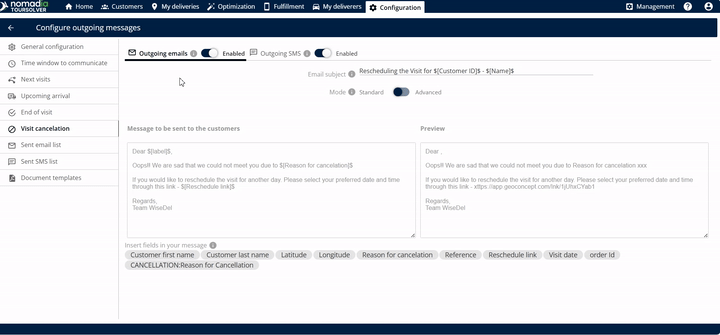
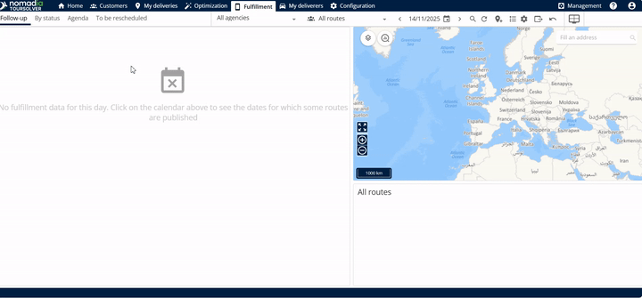
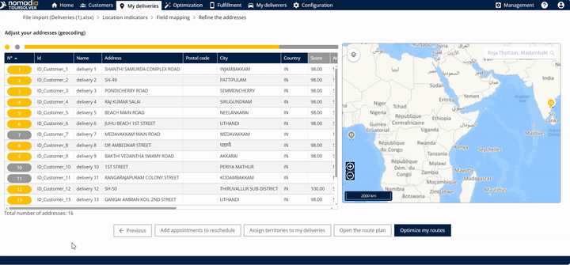

# CustomerCommunication-VisitCancellation

# Comprehensive User Guide: Customer Communication - Visit Cancellation

This guide provides simple, step-by-step instructions for managing visit cancellations and ensuring clear communication with your customers, helping you reschedule deliveries easily and efficiently.

***

## 1. Introduction

The Visit Cancellation feature is essential when a **customer is not available while you are delivering a product**. Instead of marking the item as permanently delivered, this process allows you to quickly change the status and provide the customer with the option to **reschedule the delivery**.

When you activate a visit cancellation, the system automatically sends an email to the customer containing the reason for the cancellation and a direct link for them to reschedule.

## 2. Getting Started Section

### System Requirements and Setup

The sources available do not specify technical system requirements or installation steps for this feature. We assume the system is already installed and accessible. This section focuses on the required initial configuration within the Visit Cancellation screen.

### Initial Configuration: Enabling Communications

Before processing a cancellation, you must ensure that communication channels are active so the customer receives the rescheduling link.

1.  **Access the Cancellation Settings:** Click the **visit cancellation** option.
2.  **Enable Outgoing Messages:** Ensure both outgoing communication types are turned on:
    *   **Outgoing emails**
    *   **Outgoing SMS**
3.  **Set the Email Subject:** Mention the specific **email subject** you want the customer to see.

***

## 3. Feature Explanations and Benefits

This feature streamlines communication and logistics when a delivery attempt fails due to customer unavailability.

| Feature | Context and Usefulness | Benefit to You |
| :--- | :--- | :--- |
| **Status Change** | Allows you to change the status from "delivered" to **"not delivered"**. | Prevents inaccurate fulfillment records and keeps the order active for rescheduling. |
| **Outgoing Email/SMS** | Provides the customer with the **reason for cancellation** and the **rescheduling link**. | Immediately informs the customer and empowers them to select a new time, reducing manual follow-up calls. |
| **Email Preview** | Allows you to **see the preview of the email** before it is sent. | Ensures the message body (which contains the reason and rescheduling date) looks professional and clear. |
| **Fulfillment Tab Listing** | Canceled visits are listed under the **Fulfillment tab** in the **to be rescheduled** section. | Centralizes all appointments needing new dates, making it easier for the deliverer to manage logistics. |

💡 **Tip:** The body of the email automatically includes the **reason for cancellation** and the **rescheduling date** information.

***

## 4. Common Tasks with Detailed Steps

These steps detail how to initiate a cancellation and how to add a canceled appointment back into the delivery schedule.

### Task A: Notifying the Customer of Cancellation (GIF 1)

This process sends the notification to the customer, allowing them to reschedule their delivery.

| Step | Action and Visual Guidance (GIF) | Expected Outcome |
| :--- | :--- | :--- |
| **1. Set up Communication** | **Enable** both outgoing emails and outgoing SMS, and specify the **email subject**. | Communication channels are ready to send the cancellation notice. |
| **2. Review Email** | Review the body of the email, which contains the reason for cancellation and the rescheduling link. **See the preview of the email**. | You confirm the customer will receive clear instructions. |
| **3. Send Notification** | Click on **save**. | The customer receives the email containing the rescheduling link. |

**Visual Guidance Example:**

📹 Timestamp 0:41–0:56 (CustomerCommunication-VisitCancellation.mp4): Mention email subject, view email body, and click on **save** – Customer receives email with rescheduling link.

### Task B: Managing Rescheduled Appointments (GIF 2 & 3)

After a visit is canceled, the deliverer must pull the appointment back into the schedule once a new date is selected.

#### Part 1: Finding the Data

1.  **Access Fulfillment:** Go to the **fulfillment tab**.
2.  **View Canceled List:** Click on **to be rescheduled**.
3.  **Review Data:** You can **see the rescheduled data here**.

**Visual Guidance Example:**

📹 Timestamp 1:42–1:46 (CustomerCommunication-VisitCancellation.mp4): View the rescheduled data.

#### Part 2: Adding the Appointment Back to the Schedule

1.  **Access Deliverer Tools:** The deliverer should click on **my deliveries**. (Note: Initially, the source mentioned 'my delivery' but corrected it to 'my deliveries').
2.  **Select Appointments:** Click on **add appointments to reschedule**.
3.  **List and Add:** **List the data here** and click **add**.

**Expected Outcome:**
The rescheduled list **will be added successfully**.

**Visual Guidance Example:**

📹 Timestamp 2:10–2:15 (CustomerCommunication-VisitCancellation.mp4): List data and click **add**.

***

## 5. Productivity Tips

*   **Always Enable Both:** For maximum customer reach, ensure you **enable the outgoing emails and the outgoing SMS** when setting up the cancellation. This provides redundancy in case the customer misses one communication method.
*   **Use the Preview Feature:** Before clicking **save**, always utilize the feature to **see the preview of the email**. This confirms the cancellation reason and rescheduling link are displayed correctly, preventing communication errors.
*   **Track Rescheduled Items:** Regularly check the **fulfillment tab** under **to be rescheduled**. This ensures no canceled visits are missed and keeps your logistics workflow current.

