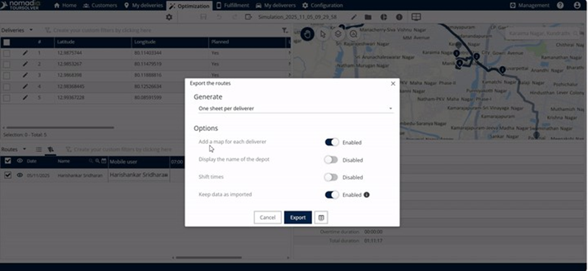
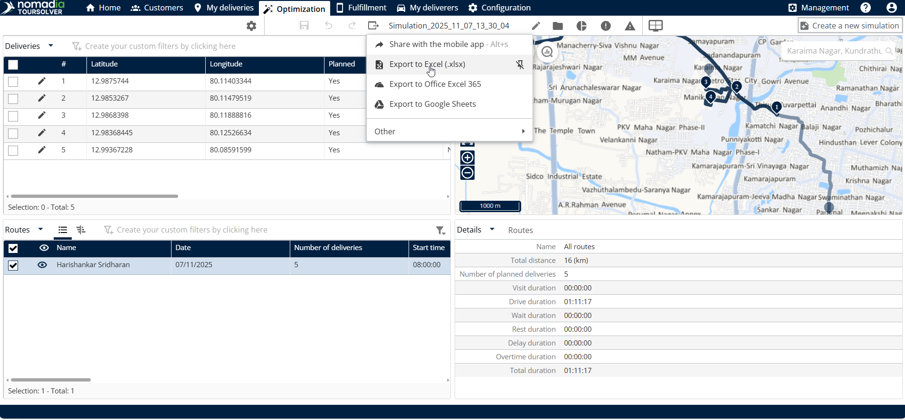
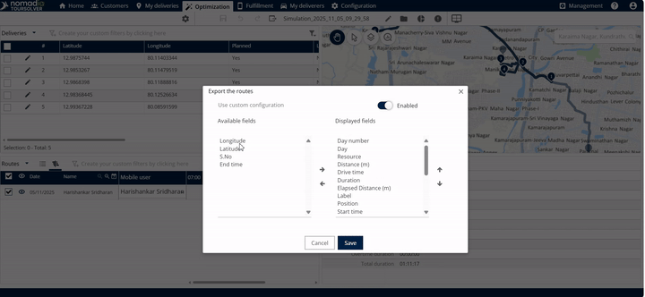
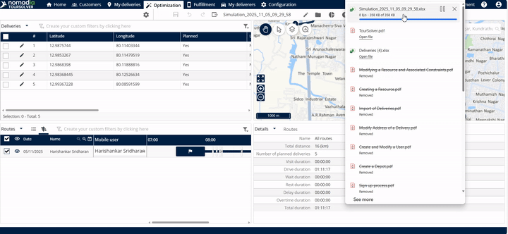
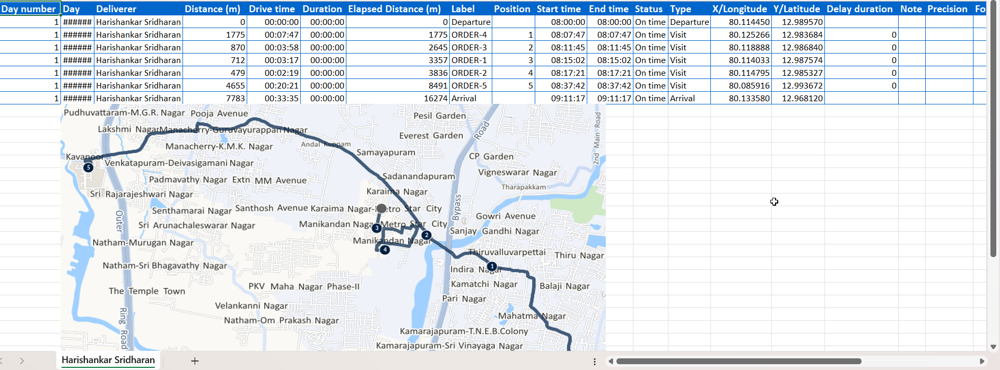

# Export my Routes

### 1. Introduction

This guide will teach you how to select, customize, and export your completed routes using the route management system. Whether you need to share results with a team member via Excel or integrate data into a calendar, this process is designed to be straightforward and effective.

**Customizing Your Excel Export Settings**

When you choose to export to Excel, the system provides several options to tailor the resulting file.

1.  **Select Your Sheet Layout:** Choose how the route data is organized:

    * **One sheet for all deliverers**.
    * **One sheet per deliverer**.
    * _**Context**:_ This helps you decide if you want a consolidated view or detailed reports for individual team members.

    <figure><figcaption></figcaption></figure>

💡 **Tip:** These configurations only apply to the Excel export option. Other formats (like PowerPoint or Calendar) will use their standard output settings.

2. **Selecting Custom Fields (Columns)**

You can choose which specific columns (fields) appear in your exported file.

1. Click on **other** within the configuration window.
2. You will see a list of **available fields** and **display fields**.

<figure><figcaption></figcaption></figure>

3. You can also **enable the custom configuration** if needed.

* _Context:_ When finished, the export file will contain both **standard and mapped columns**.

4. Click **Save** when you are done customizing the fields.

***

### 3. Feature Explanations and Benefits

The primary benefit of the route export feature is its flexibility, allowing you to quickly share data in formats suitable for various stakeholders.

#### Diverse Export Destinations

By clicking the **export option** and selecting **other**, you unlock a wide array of export types.

| Export Feature                                                   | Benefit/Usefulness                                                                               |
| ---------------------------------------------------------------- | ------------------------------------------------------------------------------------------------ |
| **Export to Excel**                                              | Ideal for detailed data analysis, calculations, and structured reporting.                        |
| **Export to PowerPoint / Office 365 PowerPoint / Google Slides** | Useful for quickly generating presentations or summaries for meetings.                           |
| **Export to Calendar (Office Outlook / Google)**                 | Allows route schedules and timings to be integrated directly into personal or team calendars.    |
| **Export a summary of routes send by email**                     | Efficiently shares a high-level overview of the route plan with recipients.                      |
| **Export to Masternaut .GPX / Extended .GPX**                    | Necessary for use with specific GPS navigation systems or advanced mapping software.             |
| **Export to KML format Google etc.**                             | Standard format for viewing geospatial data (like routes) in mapping tools (e.g., Google Earth). |
| **Export to Webhook**                                            | Facilitates automated data transfer to other operational systems.                                |

### 4. Exporting a Route to Excel

This is the most common task and includes selecting the route, choosing the destination, configuring settings, and finalizing the download.

#### Step-by-Step Guide

Follow these steps to successfully export your selected route:

**Locate Optimization Section**

1. Start from the system **home page**. Click on Optimization

**Select the Route**

2. **Click the route** that you wish to export.

<figure><figcaption></figcaption></figure>

3. **Initiate the Export Dialogue**

**Choose Excel Format**

4. Since you wish to export the data in Excel, click on **export to Excel**.

<figure><figcaption></figcaption></figure>

**Configure and Generate the File**

5. Review and adjust your initial configuration settings (Sheet Layout, Timings, Data Integrity) as outlined in Section 2.

<figure><figcaption></figcaption></figure>

6. If you customized fields, ensure you clicked **Save**.

<figure><figcaption></figcaption></figure>

**Finalize Export and Open File**

7. Click the **downloaded file** to open it

<figure><figcaption></figcaption></figure>

8. Please find the **downloaded excel file** below.

<figure><figcaption></figcaption></figure>

***

### 5. Productivity Tips

Here are some ways to make the route exporting process more efficient:

* **Customize Columns for Efficiency (Filtering Data):** If you only need two or three specific data points for a quick analysis, use the **other** option in the configuration menu to remove unnecessary fields. This keeps your report clean and focused, ensuring the export file contains only **standard and mapped columns** that matter most.
* **Use Calendar Export for Scheduling:** Instead of exporting complex data, use the **export to calendar** option (Office Outlook or Google) to quickly give deliverers their finalized shift timings and route appointments, simplifying daily logistics.
* **Save Configuration Time:** Once you have set up your desired sheet layout and field selections (like generating **one sheet per deliverer** or including **shift timings**), click **Save**. This allows you to quickly execute the export in the future without re-selecting all the detailed configurations.
