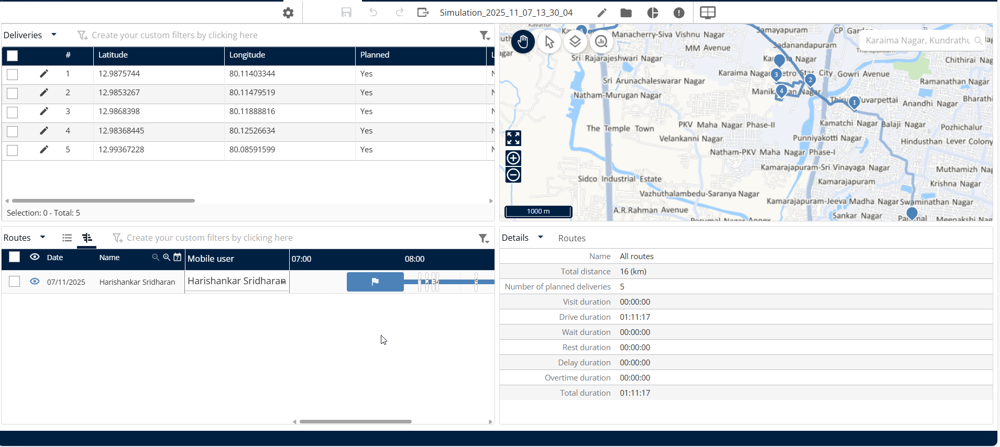

# Optimize your Deliveries

### 1. Introduction

The **Optimize your Deliveries** feature streamlines your operations by calculating the best possible delivery sequence and routes. Using this guide, you will learn how to set your optimization preferences and successfully start the route planning process.

***

### 2. Getting Started

To begin using the optimization feature, it is assumed that you have already imported your delivery data into the system.

### 3. Accessing the Optimization Screen

Before you can start optimizing, you must navigate to the starting point of the process.

1. Navigate to **My Deliveries**.
2. After ensuring deliveries are imported, click **Next**.
3. Click on **Optimize My Routes**.

***

### 3. Feature Explanations and Benefits

The **Optimize your Deliveries** offers two primary customization features that give you control over how routes are planned:

* **Route Optimization:** This core function takes all your imported deliveries and calculates the most efficient route schedule.
  * **Benefit:** Successfully optimized deliveries, ensuring efficient use of time and resources.
* **Editable Optimization Dates:** You can specify exactly when the optimized routes should begin running by entering or editing the start date and the end date.
* **Editable Planning Days:** You have the ability to adjust the number of days the system should plan for. This is useful if your operational needs change.

***

### 4. Common Tasks with Detailed Steps

#### Starting Route Optimization

This task walks you through selecting the time frame and launching the route calculation process.

1. **Set the Optimization Date Range:** On the optimization screen, enter or edit the desired start date and end date for the optimized routes.
2. **Edit the Number of Days (Optional):** If needed, you can adjust the number of planning days directly on this screen.

3. Click on **Start Optimization**

#### Adjusting the Planning Period (Number of Days)

If you need to change how many days the system should plan routes for, you can configure this setting within **My Deliveries**.

1. **Access My Deliveries:** Go to **My Deliveries**.
2. **Find the Delivery Name:** Locate the name associated with the delivery set you wish to modify.

3. Click on **Planning**

5. **Edit Days:** Change the value to the new number of days you wish to use for planning.
6. Click on **Save**

#### Viewing Optimization Results

Once the optimization is running, you can monitor the results.

**Review Results:** You will see the optimization result summary.

Click on **Display the Simulation**

4. Deliveries have been optimized successfully.

<figure><figcaption></figcaption></figure>

### 5. Productivity Tips

* ⏳ **Tip: Be Patient with Large Jobs:** If you have many deliveries that need optimization, the process may take longer than expected. This is normal because the system is performing complex calculations.
* ✅ **Tip: Check Results Early:** You don't always have to wait for the entire process to finish. If you need a preliminary result quickly, you can click **Stop and see the result** at any time during the calculation.
* 🎉 **Success Confirmation:** Once the system confirms that "The deliveries have been optimized successfully," you know your new routes are ready to implement.
