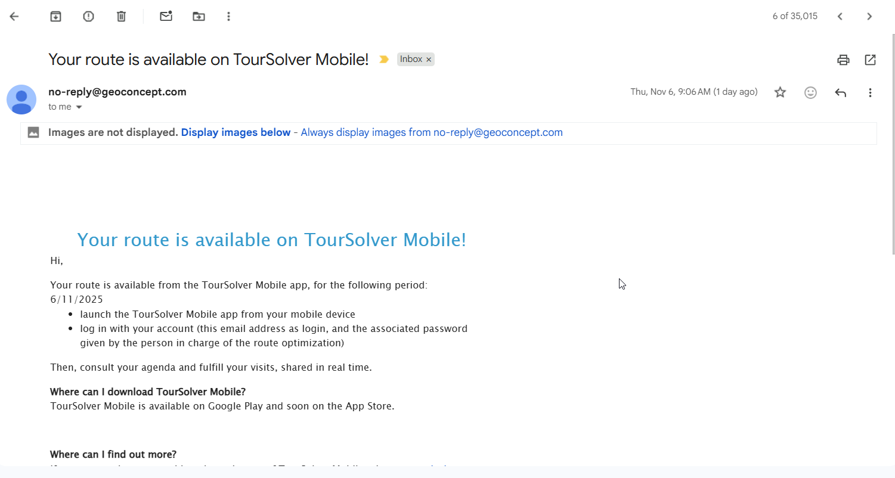

# Share a Tour with the Mobile App

## 1. Introduction

This guide walks you through the process of exporting a planned route ("tool" or "tour") from the desktop system directly to the mobile application used by your field team. This process ensures mobile users receive an email or SMS notification containing the shared tour and its associated deliveries.

## 2. Getting Started Section

To successfully share a tour, you must first access the optimization section and select a completed route.

| Account Type           | Notification Sent  | Content Sent                                                                |
| ---------------------- | ------------------ | --------------------------------------------------------------------------- |
| **Trial Version**      | SMS notification   | Link to download the mobile application                                     |
| **Subscribed Version** | Notification Email | Notification to all selected mobile app users that the tour has been shared |

### Understanding Notifications

When you share the tour, the system handles notification delivery based on your account status:

## 3. Feature Explanations with Benefits

The **Share with the Mobile App** feature is crucial for connecting your planning efforts with real-world execution.

* **Seamless Route Transfer:** Easily transfer complex, optimized routes (tours) directly to the mobile device where they are needed.
* **Date-Specific Sharing:** You can control the exact date range for which the tour is active and accessible on the mobile app. Sharing a tour for a specific date range (e.g., 1 day duration) confirms exactly which deliveries should be performed on the selected date(s).
* **Confirmation Feedback:** The system provides clear feedback regarding how many deliveries are being shared and how many notifications are being sent to mobile users.

***

## 4. Sharing a Tour

Follow these detailed steps to successfully share your optimized route with your mobile users.

### Exporting and Sharing an Optimized Tour

1. Click on **Optimization**

2. Choose the **desired route** from the list

3. Click on **Export** and click on **Share with the Mobile App**

5\. **Set the Start Date (From Date):** Enter the start date from which you want the tour to be shared.

6. Choose a **Desired starting date**

7\. **Set the End Date (To Date):** Choose a "**to date**".

**Note**: The standard duration will be 1 day, but you can adjust the "to date" if necessary.\
Date Selection interface showing From Date, To Date, and Duration (1 day)

8. **Review the Notification (Trial/Subscribed):** Read the confirmation notification displayed based on whether you are using a trial or subscribed version.

9. Click on **Send**

Final Confirmation Pop-up showing details of deliveries shared and emails sent

<figure><figcaption></figcaption></figure>

## 5. Productivity Tip

* **Tip: Verify Delivery Counts:** Always pay close attention to the final notification that appears when you click **send. This** message confirms exactly how many deliveries are included in the tour you are sharing and how many emails are being sent to your mobile users.
