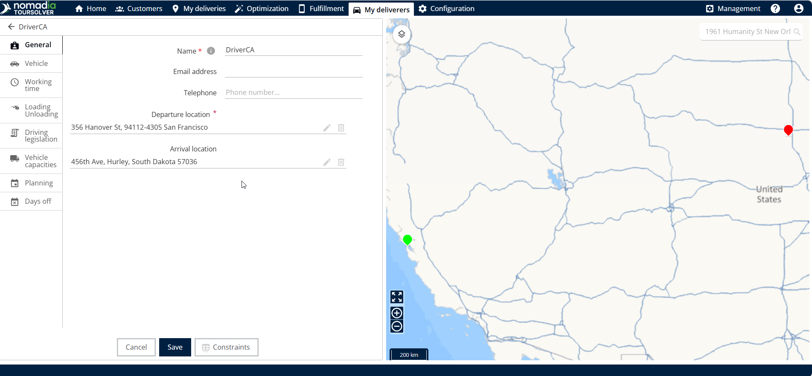
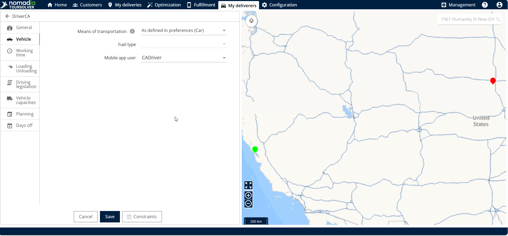

# Creating a Resource

## 1. Introduction

Welcome! This guide will walk you through the simple steps of defining a Resource such as a delivery staff member or a driver—within TourSolver. Our goal is to make sure you can set up your team members accurately and confidently, allowing the system to manage vehicle assignments, work schedules, and time off effectively.

## 2. Navigating to Resource Page

To begin defining a new resource profile:

1. Go to the **Resource page.**
2. Click on **Add** located within the Actions menu.

<figure><figcaption></figcaption></figure>

## Feature Explanations and Context

* Creating a resource involves filling out several tabs that define how your staff member operates, travels, and when they are available.
* **Resource Details (General Info**): This is where you identify the staff member by name and specify their starting point, known as the departure location.
* **Vehicles Tab**: Here you define the primary way the staff member travels by selecting the means of transportation.
* **Vehicles Capacities Tab**: This section is crucial for defining what the resource (or their assigned vehicle) can carry. You can add vehicle capacities to ensure constraints are met during planning.
* **Working Time and Planning Tabs**: These sections define the staff member's availability, including selecting whether the automatic start time feature is active, defining specific work slots, and scheduling lunch breaks.
* **Days Off Tab**: This allows you to schedule specific dates when the resource will be unavailable

💡 Tip: If you are ever unsure about a specific field or constraint while entering details, you can hover over the tool tip icons for clarification. Each tool tip provides a short explanation of what that constraint controls.

## Detailed Steps for Resource Creation

Follow these steps to successfully create and define your new delivery staff member or driver.

### Defining Basic Resource Information

1. Enter the **full resource name**.
2. Enter the **departure location** (where the resource starts their shift).

<figure><figcaption></figcaption></figure>

1. Go to the **Vehicles tab.**
2. Select the **means of transportation** (e.g., car, bike, truck).

<figure><figcaption></figcaption></figure>

1. Go to the **Working time tab.**
2. Select whether you want the automatic start time feature to be active (yes or no).

<figure><figcaption></figcaption></figure>

### Setting Vehicle Capacities

If your resource is transporting goods, you must define their capacity limits:

1. Go to the **Vehicles Capacities tab**.
2. Click on the plus symbol **(+)** located at the bottom corner.
3. Add the necessary vehicle capacities in the available fields.

<figure><figcaption></figcaption></figure>

**To Delete a Capacity Slot:** If you need to remove a capacity entry, click on the delete icon located on the right side.

### Managing Work Schedules (Planning)

The Planning tab lets you define the specific work slots and breaks for the resource.

#### To Add/Edit Work Slots:

1. Go to the **Planning tab**.
2. Click on the **work slot**.
3. Click the **edit slot** button.
4. Add the specific work timings and click **edit**.

<figure><figcaption></figcaption></figure>

#### To Manage Lunch Breaks:

1. To edit the existing lunch break work slot, click edit **lunch break**.
2. Add the **lunch break timings.**
3. Click **edit** to save the changes to the lunch break work slot.
4. To delete a lunch break slot, click **delete lunch break**.

<figure><figcaption></figcaption></figure>

### Adding Days Off

Use the Days Of tab to schedule planned time off:

1. Go to the **Days Off** tab.
2. Click the plus icon **(+)** on the right side to add a new entry.
3. Add the required timings (from date/to date) that the resource will be on off.
4. Click the **add** icon to save the entry.

⚠ **Warning**: When setting days off, ensure that the "To date" (the end date) is higher (later) than the "From date" (the start date).

<figure><figcaption></figcaption></figure>

### Finalizing Resource Creation

1. Once you have filled in all the necessary details across the various tabs. Click on **Add**.
2. The resource will be created successfully.

<figure><figcaption></figcaption></figure>

## Productivity Tips

These tips will help you manage schedules and constraints quickly and efficiently:

* **Understand Constraints**: If you are uncertain about what a specific setting controls, always utilize the tool tip icons by hovering over them for a quick explanation.
* **Quickly Duplicate Work Slots**: If a resource has multiple identical work slots, you can save time by clicking the duplicate work slot option and then clicking duplicate to quickly add a copy.

<figure><figcaption></figcaption></figure>

* **Managing capacity**: Remember that you can always delete unwanted vehicle capacities by clicking the delete icon on the right side of the entry.
