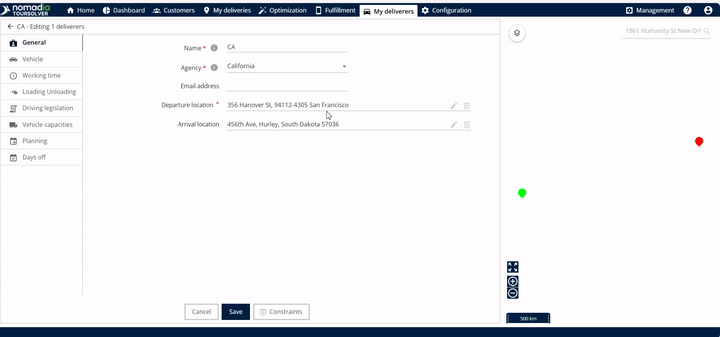
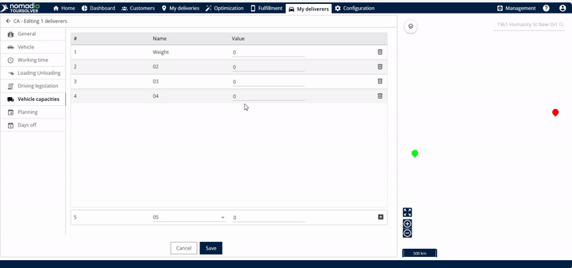
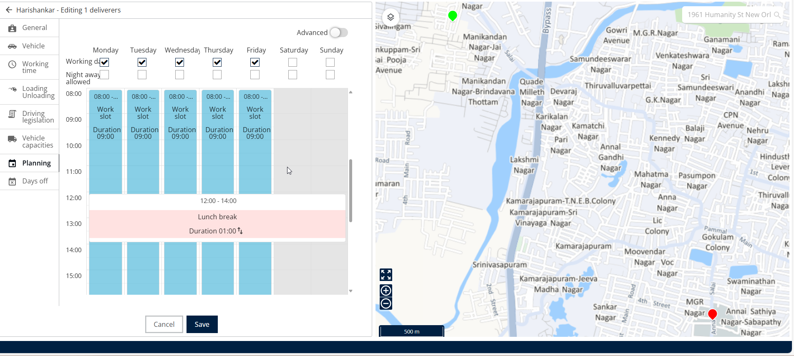

# Modifying a Resource and Associated Constraints

### 1. Introduction

Welcome to your guide for efficiently managing and updating your delivery resources and their key restrictions, or "constraints". Knowing how to modify a resource—whether it's adjusting a team's availability or changing an individual's vehicle capacity—is essential for smooth operations. In this guide, you will learn exactly how to change scheduling, locations, and capacities quickly and successfully

### 2. Accessing the Resource Management Area

You can start modifying resources and constraints directly from the systemʼs homepage.

#### Access My Deliverers

<figure><figcaption></figcaption></figure>

1. **Choose Your Modification Method:** You have two primary ways to modify a resource: team-wise (affecting a group) or individually.

<figure><figcaption></figcaption></figure>

2. Click the **edit** (pencil) icon next to the name

<figure><figcaption></figcaption></figure>

3. You can start modifying the associated constraints.

### 3. Feature Explanations and Benefits

The constraints are the rules that govern when, where, and how a resource operates. Here are the commonly used constraints explained:

* Departure and Arrival Location: This setting defines the start and end point of the resource's day. Modifying these locations is crucial if a resource's typical starting or ending address changes (e.g., if they are working from a different depot or returning home).
* Vehicle Capacities: This allows you to set limits on the vehicle's capacity, typically measured by weight. This ensures that your delivery vehicle is never overloaded, which helps with safe and compliant routing. You can set the weight value in kilograms (kg) or grams (g).
* Planning (Work Slots): This determines the resource's working availability. You can manage exact start and end times, and specify which days of the week they are available.

Tip: The video focuses on commonly used constraints. To learn more about any other constraints, please refer to the constraint documentation.

### 4. Detailed Modification Steps

Once you have accessed the constraint modification screen (using the pencil icon), follow the steps below to update specific resource details.

### Modifying Departure and Arrival Locations

If a resource's start or end point changes, you can update it here.

1. **Locate the Address**: To modify the departure or arrival location in general, look for the relevant section (Departure Location or Arrival Location).
2. **Update Address**: Modify the departure address as needed.
3. **Update Address**: Modify the arrival location.

<figure><figcaption></figcaption></figure>

After modification, you will see the differences on the map. The color used will be different for the departure and the arrival locations (e.g., green or red).

### Updating Vehicle Capacities (Weight)

1. You can manage the maximum weight a resource's vehicle can carry.
2. **Modify Value**: Modify the value of the weight. You can input this value in kilograms or grams.

<figure><figcaption></figcaption></figure>

The Planning section controls when your resource is available to work. There are two methods for modifying work times: Simple View and Advanced View.

#### Simple View (Same Schedule Every Day)

Use Simple View if the work hours are the same across all working days.

1. **Access Planning**: Click on Planning.
2. **Access Time Slot**: In Simple View, Click on the time slot.
3. **Edit Work Slot**: Click on Edit Workslot.
4. **Set Start and End Times**: Modify the start time and the end time.
5. **Confirm**: Click on **Edit**.

<figure><figcaption></figcaption></figure>

#### Advanced View (Different Schedules for Different Days)

Use Advanced View if you need to set unique start and end times for specific workdays.

1. **Access Planning**: Click on Planning.
2. **Select Work Days**: In Advanced View, you can modify "work days" (e.g., work day 1, work day 2, etc.). You can specify a range, such as 1 to 5, which represents Monday to Friday. You can also input specific days like 1, 2, 3, 4, 5.
3. **Make Adjustments**: The clock image will display, allowing you to make your adjustments.
4. **Confirm Timing**: After doing the modification inside the clock, Click on OK.

<figure><figcaption></figcaption></figure>

### Saving All Modifications

Once you have completed all necessary changes across **Departure, Arrival, Capacity, and Planning:**

* The changes will be displayed successfully

<figure><figcaption></figcaption></figure>

## 5. Productivity Tips

To help you get the most out of resource management:

* **Efficient Time Editing**: Use the clock icon next to the time to quickly bring up the clock image and make precise time adjustments.
* **Quick Deletion**: If you need to remove a specific vehicle capacity value, look immediately to the right side of the weight entry for the delete icon.
